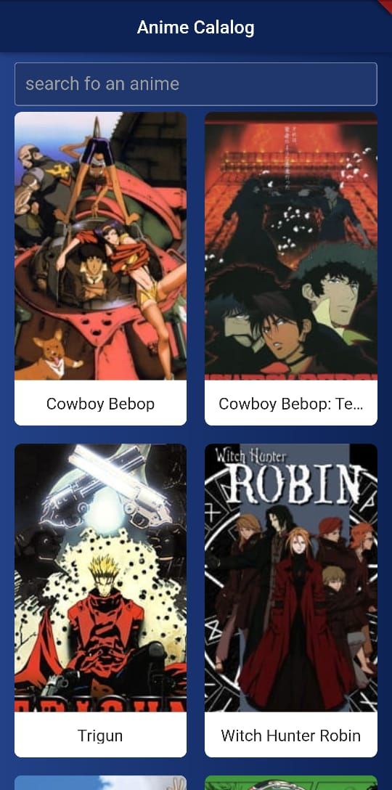
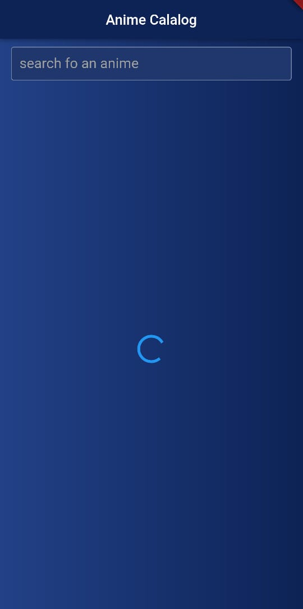
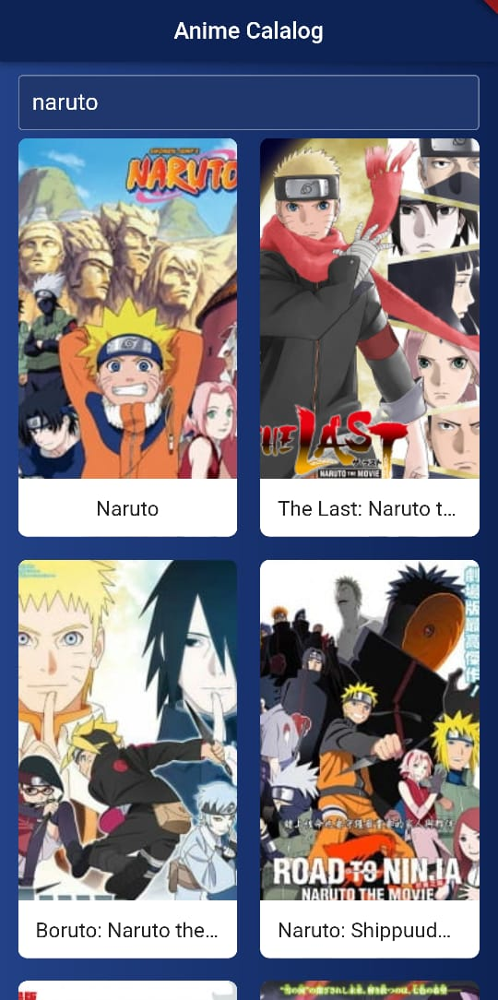
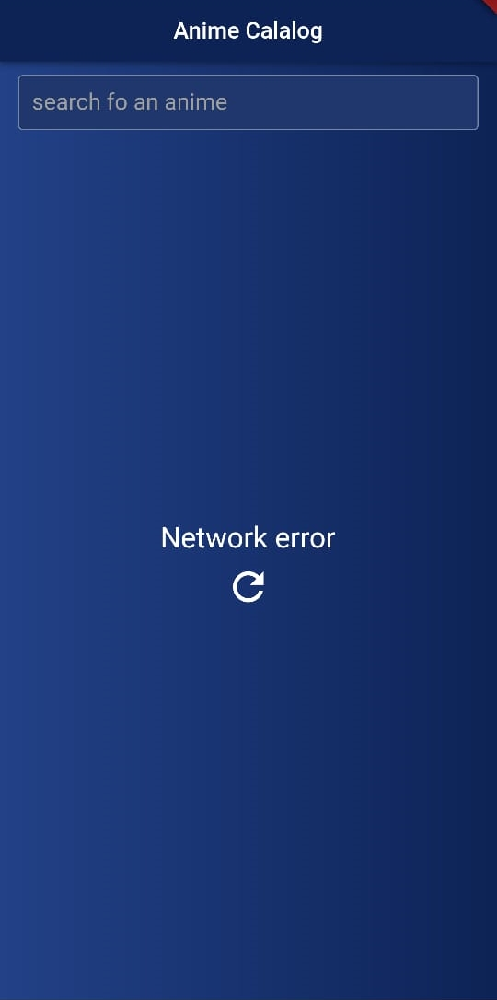

# Anime Catalog

Anime Catalog is a Flutter application that  consume an API to fetch and display data.

## Features

- Display data fetched from the API: https://jikan.moe/
- Render anime items in a GridView on the main screen.
- Include a search bar to filter anime items based on user input.
- Show a details page for each item displayed in the main interface.
- Handle loading and error states while fetching data.

## Screenshots

### Home page

### Loaging Page

### Search Result Page

### Details Page

### Network Error Page

## Getting Started

This project is a starting point for a Flutter application.

A few resources to get you started if this is your first Flutter project:

- [Lab: Write your first Flutter app](https://docs.flutter.dev/get-started/codelab)
- [Cookbook: Useful Flutter samples](https://docs.flutter.dev/cookbook)

For help getting started with Flutter development, view the
[online documentation](https://docs.flutter.dev/), which offers tutorials,
samples, guidance on mobile development, and a full API reference.
